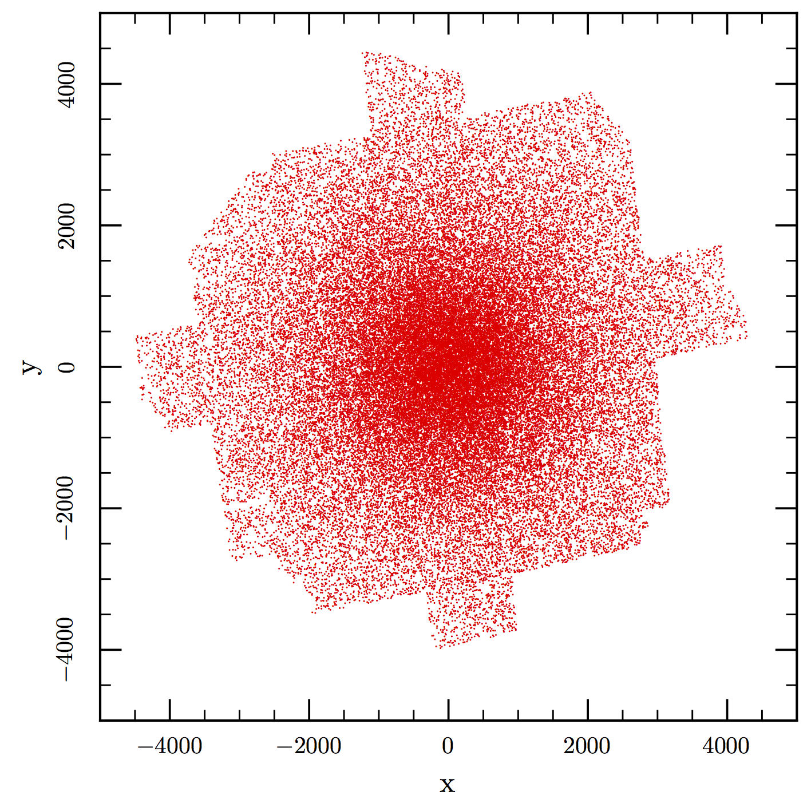
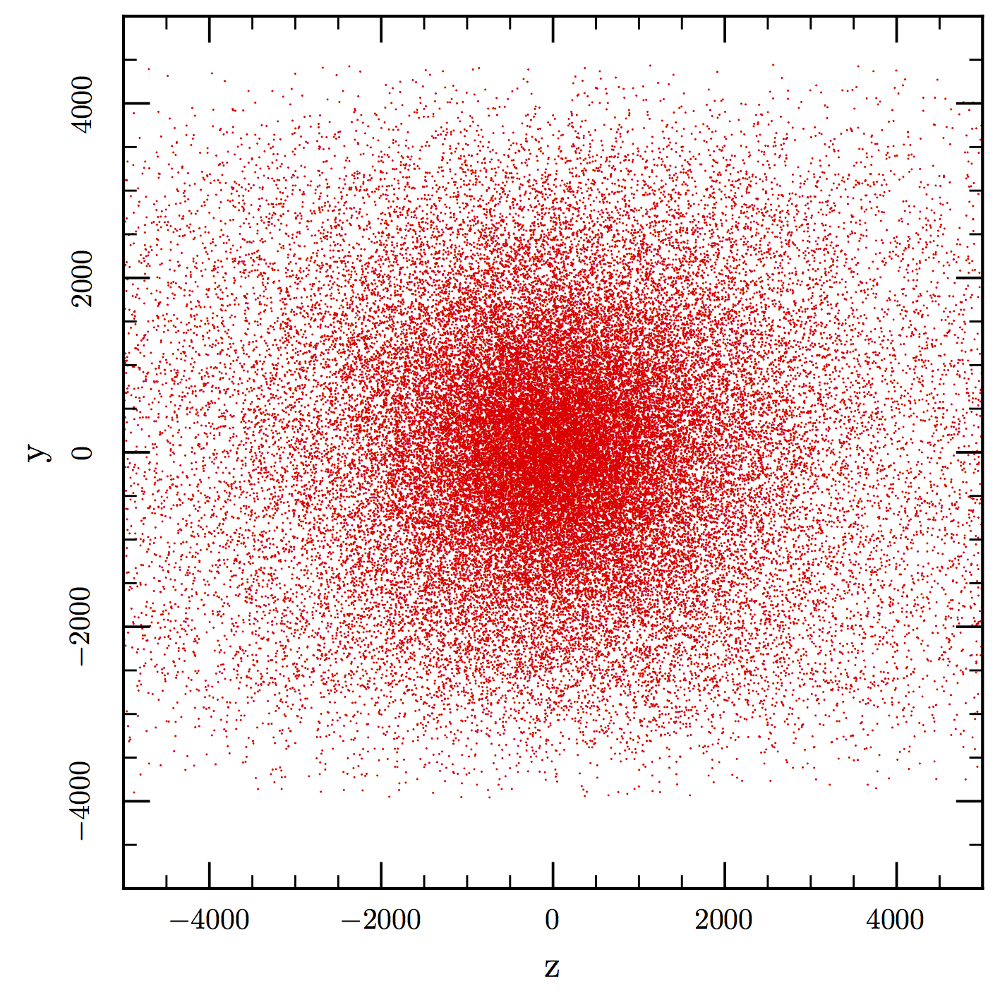
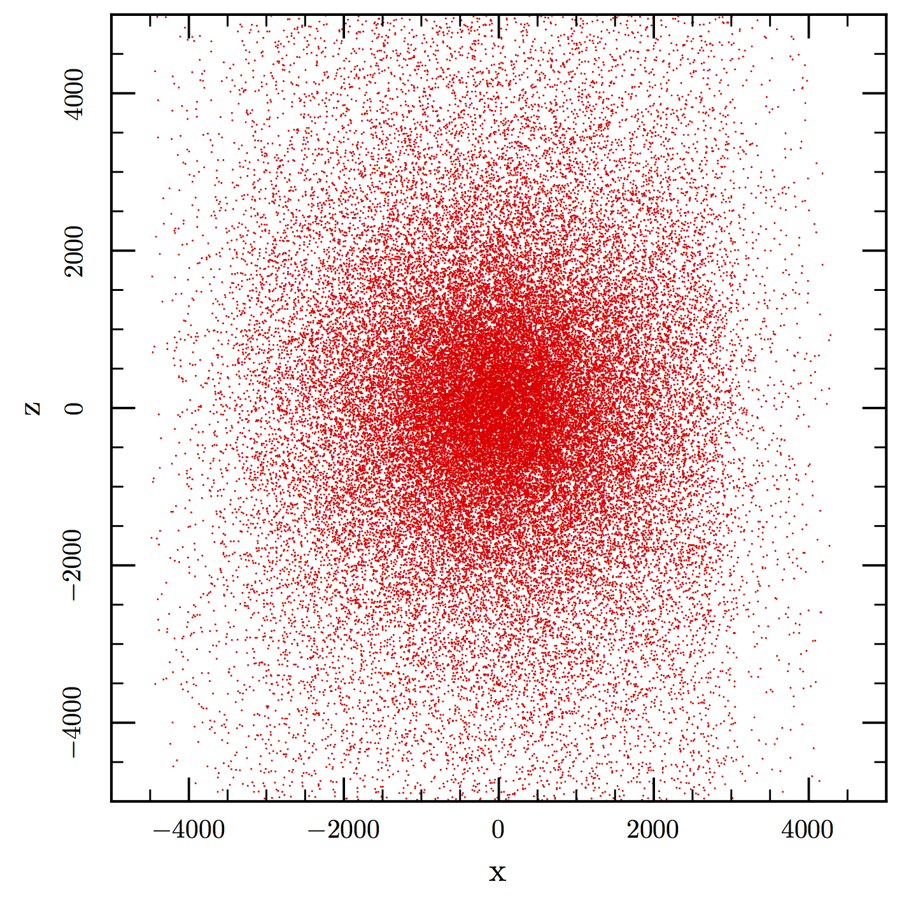
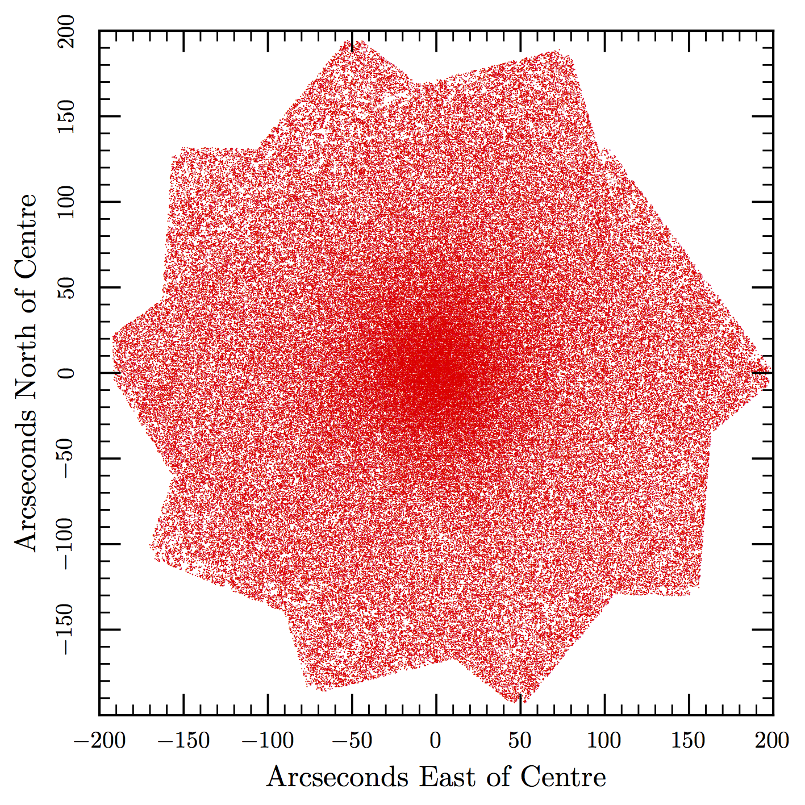
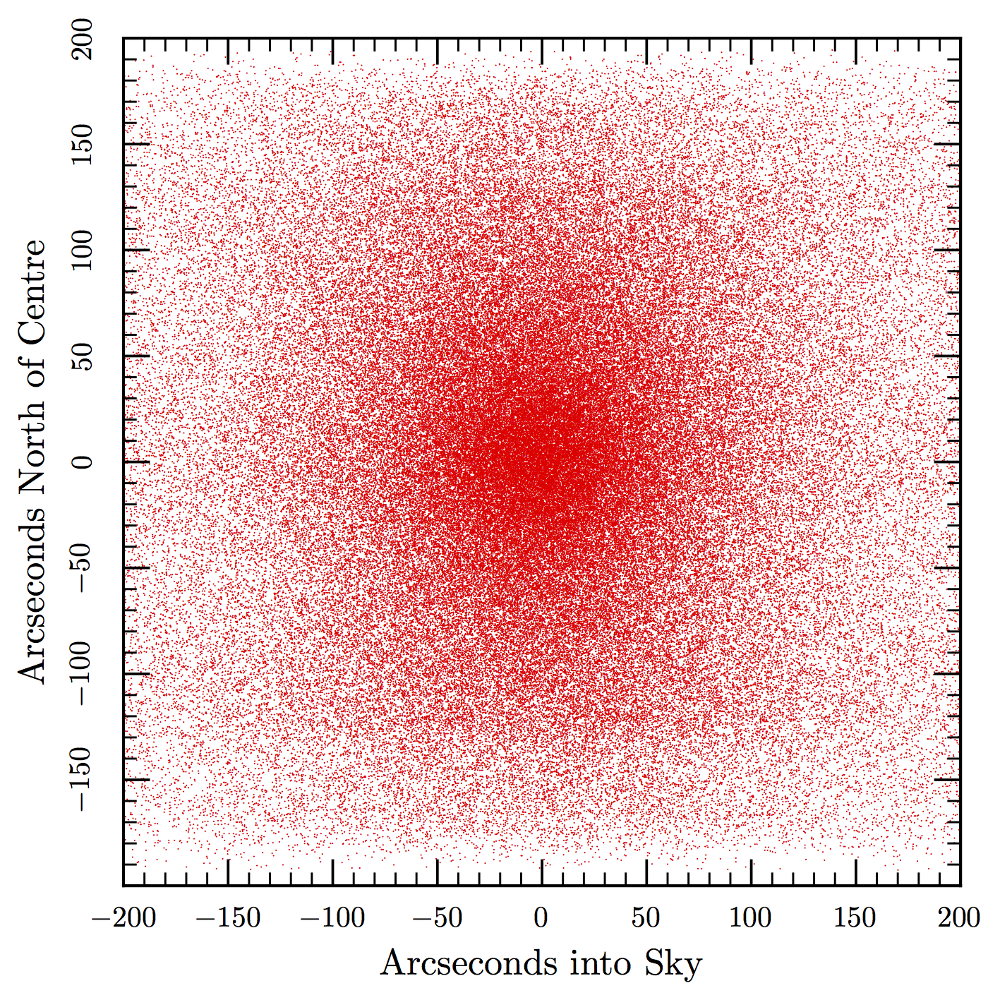
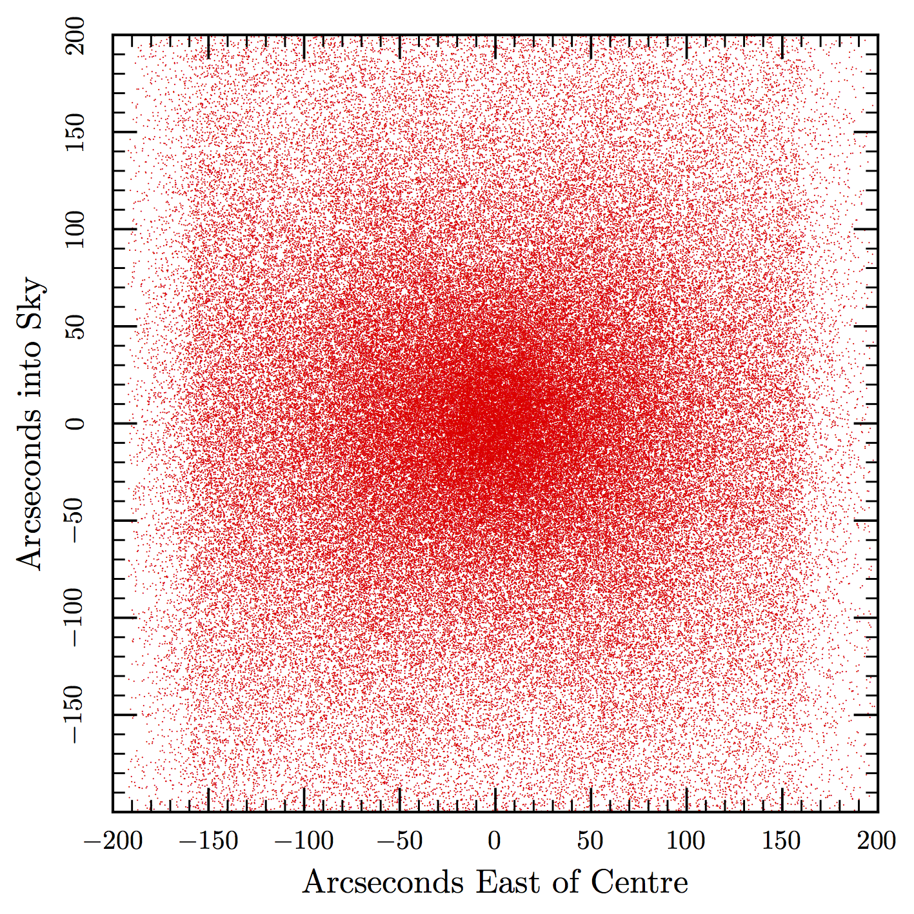

# Make3D

## Smaller field with star motions too 

There are 57571 stars in the file pm_v6_chris.dat and the output test_3d.dat

The centre of the cluster on the sky (x and y)

Looking on the cluster from the right side (z and y)

Looking on the cluster from the top (x and z)

## Larger field 

These are the stars in the image at http://www.coolpulsars.org/images/47TucCore_Image/ about 194,004 in total from the file field.dat.gz and the output center_3d.dat.gz 

The centre of the cluster on the sky (x and y)

Looking on the cluster from the right side (z and y)

Looking on the cluster from the top (x and z)

